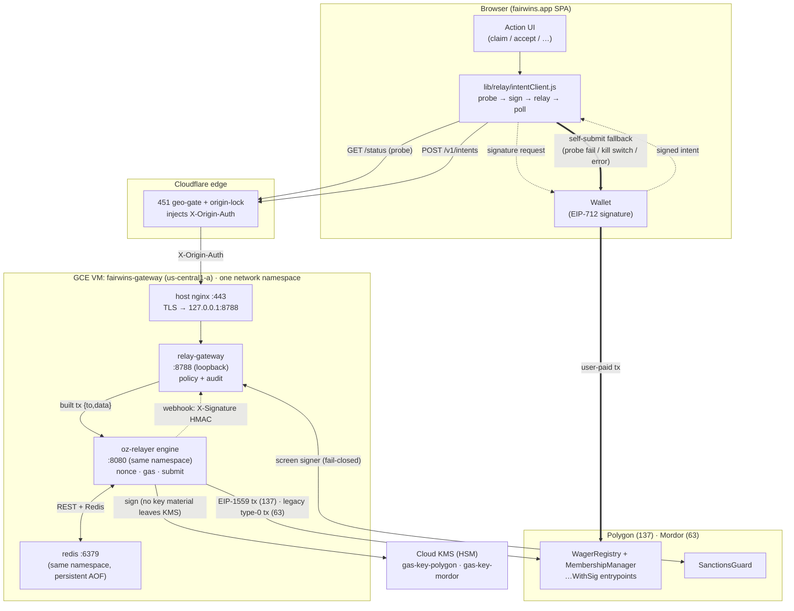
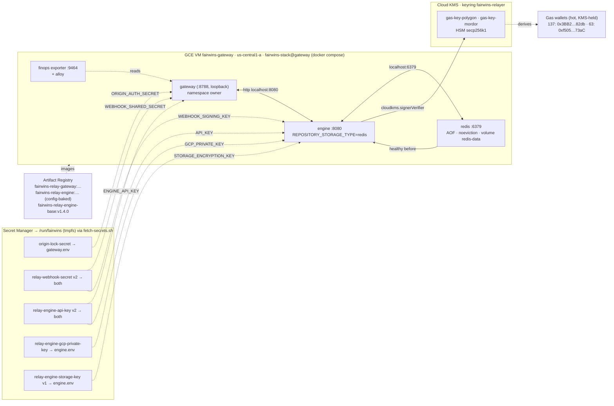

# Gasless Intent Relayer — Infrastructure Architecture (spec 036)

The relayer is **optional gas infrastructure**. It lets a user sign a spec-035 intent off-chain and
have a hosted service pay the gas to submit it — but it can only ever **censor, never steal**, and
every covered action keeps a **self-submit fallback**. So the worst failure of everything below is
"the user pays their own gas," never a stuck or stolen wager.

> **Deployed footprint (Polygon 137 + Mordor 63):** one GCE VM, `fairwins-gateway`
> (us-central1-a), running a Docker Compose stack: the policy gateway, the OZ Relayer engine, a
> persistent Redis, and the FinOps exporter and Alloy beside them. All containers share one network
> namespace. The source of truth is [`infra/vm/gateway/docker-compose.yml`](../../infra/vm/gateway/docker-compose.yml)
> and [`infra/vm/README.md`](../../infra/vm/README.md). The earlier Cloud Run service
> (`fairwins-relay-gateway`) was decommissioned when the stack moved to GCE; its manifest is kept only
> as a historical snapshot (`services/oz-relayer/deploy/production/service.yaml`). This is the sanctioned
> exception to the platform's no-backend rule — see
> [../developer-guide/gasless-intents.md](../developer-guide/gasless-intents.md), the migration record
> [../runbooks/vm-migration.md](../runbooks/vm-migration.md) and the operations runbook
> [../runbooks/relayer-operations.md](../runbooks/relayer-operations.md).

---

## 1. System context — where the relayer sits



**Read it as two paths.** The **relayed path** (solid): the SPA probes `/status`, has the wallet sign
the intent, POSTs it through Cloudflare to the gateway; the gateway recovers + screens the signer,
builds the exact call, and hands it to the engine, which signs with the KMS key and submits. The
**self-submit path** (thick dashed): on any probe failure, kill switch, or relay error the SPA
silently has the user submit the same action themselves — identical on-chain result (FR-016 / SC-004).

---

## 2. Deployment topology — one GCE VM, one Compose project

All containers of the gateway VM join the gateway container's network namespace
(`network_mode: "service:gateway"`), which reproduces the old Cloud Run sidecar namespace exactly. That
keeps every `localhost` coupling correct verbatim: `ENGINE_URL=http://localhost:8080`,
`REDIS_URL=redis://localhost:6379`, and the engine's webhook `http://localhost:8788/v1/engine/webhook`
in `config.json`. Only the namespace owner (the gateway) publishes a port, and only to `127.0.0.1:8788`;
the host nginx terminates TLS on :443 and is the sole route in. Phase 1 stays **single-instance**
(one nonce-lane owner, in-process dedup/quota), so exactly one engine runs per wallet: always restart the
whole `fairwins-stack@gateway` unit, never a single container (`infra/vm/README.md`).



The VM runs as the least-privilege **`fairwins-relay-engine`** service account (unchanged from Cloud
Run), which holds only `cloudkms.signerVerifier` on the gas keys plus per-secret
`secretAccessor` (`infra/terraform/environments/prod/terraform.tfvars`, `gateway_secret_ids`). Each
container receives only its own env file (`infra/vm/common/fetch-secrets.sh`; `common/preflight.sh`
asserts the split at every start, e.g. the KMS credential and the storage key never reach the
internet-facing gateway). The gas keys never leave KMS; their **public** keys derive the funded
addresses.

**State.** The engine keeps its relayers, transactions, signers, nonce counter and job queue in Redis
(`REPOSITORY_STORAGE_TYPE=redis`, #1652): a restart no longer forgets pending transactions, and a
`config.json` edit is no longer applied by a restart. See
[../runbooks/relayer-operations.md](../runbooks/relayer-operations.md) § Storage mode. Before #1652
the engine was in-memory and Redis was an ephemeral queue.

**Engine config and logs.** `services/oz-relayer/deploy/production/config.json` is mounted read-only
from the repo checkout on the VM (`/opt/fairwins/repo/…`). The engine's `rpc_urls` are public
endpoints listed in that file, deliberately separate from the gateway's keyed RPC. Engine logs ship to
Cloud Logging with the `gcplogs` driver (#1653); `common/probe.sh` runs every 60 s as the
independent backstop and reports through journald and the Ops Agent.

**Not covered here.** The ERC-4337 bundler (alto) and its origin-lock nginx run on the separate
`fairwins-bundler` VM (`infra/vm/bundler/`).

> **Known limitation — exported SA key for the KMS signer.** OZ Relayer **v1.4.0**'s Cloud-KMS signer
> authenticates with an explicit service-account key (`service_account.private_key` etc., stored as the
> `relay-engine-gcp-private-key` secret) — it does **not** support keyless ADC / Workload Identity, even
> though the VM already runs *as* that same SA. So we mint one exported key for the least-privilege
> engine SA (it can only `signerVerifier` + `secretAccessor` — no data access), keep it only in Secret
> Manager, and never bake it into the image. **Follow-up (still open):** drop the key and switch to
> ADC once the engine supports it; rotate the key on any SA change (with Redis storage that rotation
> needs the reset in the runbook, because the key is stored in the signer record). A newer engine does
> **not** close this: re-evaluated 2026-10-09 (#1648), the Cloud-KMS signer still requires
> `service_account.{private_key,…}` at upstream **v1.8.0** — keyless workload identity is tracked
> upstream as OpenZeppelin/openzeppelin-relayer **#757**. Revisit when #757 ships, not on a routine
> bump (see `services/oz-relayer/README.md` § Version pin).

---

## 3. Intent lifecycle — request → confirmed

```mermaid
sequenceDiagram
    autonumber
    participant U as SPA (intentClient)
    participant W as Wallet
    participant GW as relay-gateway
    participant EN as oz-relayer engine
    participant K as Cloud KMS
    participant CH as Chain (137 / 63)

    U->>GW: GET /status (bounded ~2s probe)
    alt gateway unhealthy / kill switch / chain down
        GW-->>U: not ok
        Note over U,W: SELF-SUBMIT — user signs + sends the tx themselves. Done.
    else healthy
        GW-->>U: {status:ok, chains:{137:{rpc:up}, 63:{rpc:up}}}
        U->>W: request EIP-712 signature (intent)
        W-->>U: signed intent
        U->>GW: POST /v1/intents  (X-Origin-Auth)
        GW->>GW: recover signer · bind params · dedup · quotas · spend cap
        GW->>CH: SanctionsGuard.isAllowed(signer)  (fail-closed)
        GW->>EN: POST /transactions {to,data,speed}
        EN->>K: sign (secp256k1; EIP-1559 on 137, legacy type-0 on 63)
        K-->>EN: signature
        EN->>CH: submit raw tx (gas paid by the chain's gas wallet)
        GW-->>U: 202 {intentId, status:queued}
        EN-->>GW: webhook mined/confirmed<br/>(X-Signature = HMAC-SHA256(body, secret))
        GW->>GW: verify HMAC (timing-safe) · map to status
        U->>GW: GET /v1/intents/{id}
        GW-->>U: {status:confirmed, txHash}
    end
```

Status is **honest**: the gateway only reports `confirmed` after the engine's webhook says mined
(FR-006). Money-in intents are **rejected on ETC-family chains** (`503 payment_unsupported_on_chain`)
because live USDC there has no EIP-3009 — those flows self-submit; only no-stake (signer-attributed)
actions relay there. Polygon USDC supports EIP-3009, so payment intents relay on 137.

---

## 4. Trust & security boundaries

| Component | Holds | Can do | **Cannot** do |
|---|---|---|---|
| `relay-gateway` | two shared secrets (origin, webhook) | refuse/accept intents, screen, rate-limit | sign, move funds, forge a signer (it is *recovered*) |
| `oz-relayer` engine | KMS **handle** (not the key), and — in Redis mode — the encrypted signer/notification records | sign gas txs to allow-listed receivers, submit | exceed `gas_price_cap` (outside a NOOP cancel, which ignores it), pay non-whitelisted receivers, spend user funds |
| Cloud KMS (HSM) | the secp256k1 gas key | produce signatures | export the private key |
| gas wallets (`0x3BB2…82db` on 137, `0xf505…73aC` on 63) | POL / METC for gas | pay gas | anything else (no contract authority) |
| Cloudflare | origin-lock secret | gate + inject `X-Origin-Auth` | read intents' meaning |

Compromise bound of the **entire hosted stack** = the gas-wallet balances (a Polygon float of a few
POL, plus testnet METC) + the ability to *censor* (refuse to relay). No user funds, no contract admin, no floppy-keystore key is reachable from here.
On-chain entrypoints re-verify every signature and re-screen every actor regardless.

---

## 5. GCP resource inventory

| Kind | Name | Notes |
|---|---|---|
| GCE VM | `fairwins-gateway` | `us-central1-a`, Debian 12 + docker-ce, `fairwins-stack@gateway` systemd unit (`infra/vm/systemd/`), host nginx :443 → 127.0.0.1:8788 |
| Service account | `fairwins-relay-engine@…` | attached to the VM; `signerVerifier` + per-secret `secretAccessor` only |
| KMS keyring / keys | `fairwins-relayer` / `gas-key-polygon`, `gas-key-mordor` | **HSM** secp256k1 (software rejects the curve) |
| Gas wallets | `0x3BB28b184b8a748dE22aBD076634F85adADA82db` (137), `0xf505d95F62bEE94437C112d3D64ee7Df0Fa973aC` (63) | derived from the KMS public keys |
| Secrets | `origin-lock-secret`, `relay-webhook-secret`, `relay-engine-api-key`, `relay-engine-gcp-private-key`, `relay-engine-storage-key`, plus optional feature credentials | delivered as per-container env files on tmpfs by `fetch-secrets.sh`, never baked |
| Artifact Registry | `fairwins-relay-gateway`, `fairwins-relay-engine-base:v1.4.0`, `fairwins-relay-engine:multichain-v1.5.0` (deployed) | engine base is **built from source** (see below). What upstream version the deployed tag contains is unverified, #1650 |
| Docker volumes | `redis-data`, `alloy-data` | engine state (#1652) and the Alloy WAL |

Terraform owns the VM and the secret containers (`infra/terraform/`, spec 087); the compose files,
`fetch-secrets.sh` and the systemd units are applied by the update path in `infra/vm/README.md` (or the
Ansible `fairwins_stack` role).

---

## 6. Build-from-source & integration truths

The OZ Relayer publishes **no pre-built image** — it is built from `Dockerfile.production` at a pinned
tag (`v1.4.0`, a recorded hold: #1648) and hosted in our Artifact Registry; we layer only our config (AGPL-safe: unmodified
upstream, never forked into the repo). Things the spec assumed that turned out otherwise, all now
reflected in the config/code:

- **KMS signer needs an explicit service-account key** (no ADC/attached-SA path in v1.4.0, nor yet
  in v1.8.0 — upstream #757).
- The engine **does not expand `${VAR}`** in `config.json` → RPC + webhook URLs are literal.
- Webhook auth is **`X-Signature: base64(HMAC-SHA256(body, signing_key))`**, verified by the gateway
  over the raw body (`services/relay-gateway/src/server.js`).
- External probes, the container healthcheck and the SPA probe use **`/status`**. (Under Cloud Run,
  `/healthz` was intercepted by Google's GFE on every `*.run.app`, which is why `/status` was chosen.)
- **Polygon is EIP-1559, Mordor legacy**, chosen by the network entry's `features` in `config.json`, not by
  `tags` or `eip1559_pricing` (#1651).

## 7. Operate it

- Deploy / redeploy: the update path in [`infra/vm/README.md`](../../infra/vm/README.md) and [../runbooks/vm-migration.md](../runbooks/vm-migration.md). [../runbooks/relayer-mordor-deploy.md](../runbooks/relayer-mordor-deploy.md) is the historical Cloud Run procedure
- Incidents, kill switch, key rotation, funding: [../runbooks/relayer-operations.md](../runbooks/relayer-operations.md)
- Protocol / intent semantics: [../developer-guide/gasless-intents.md](../developer-guide/gasless-intents.md)
